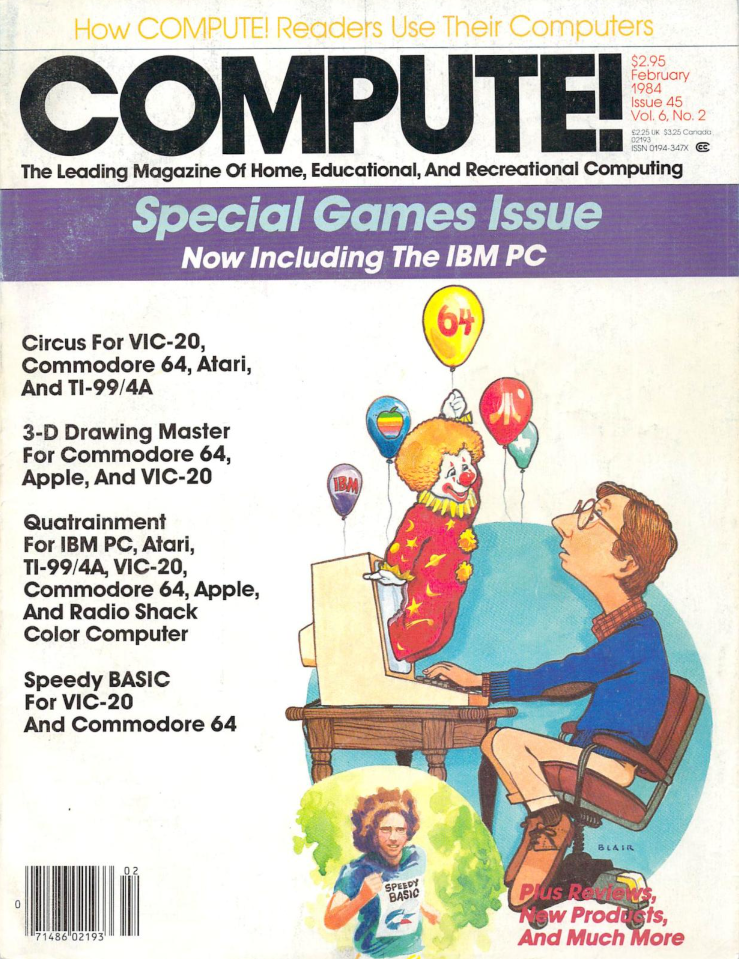

* [Overview](#overview)
* [Steps To Success](#steps-to-success)
* [Tokenzied BASIC](#tokenized-basic)

## Overview

Reviving my 40-year-old game.  Originally published in
[Compute! magazine in 1984](https://archive.org/details/1984-02-compute-magazine/page/n63/mode/2up),
the code originally targeted the Commodore VIC-20 and 64.  The ultimate
goal is to make it possible to play this game in a web browser.

## Steps To Success

As a typical geek, I'm more than willing to spend multiple times the effort required to solve the problem "manually" to solve it programmatically.  In this case, the goal is to get things running without manually entering all of the code from the magazine into an emulator.  That will require some effort, including:

* ~~Scan images of [all of the code segments](./compute/)~~
* ~~OCR those images, generate segments of [BASIC](https://www.c64-wiki.com/wiki/BASIC#BASIC_V2.0_of_C64) and clean up [resulting OCR issues](./compute/)~~
* Create [consolidated BASIC code](./src/basic/) based on the cleaned up OCR output with some minor tweaks for clarity
* Create tool to generate [tokenized BASIC](#tokenized-basic)
* Decide on and implement a web-based emulator such as a WebAseembly compiled [VICE](https://vice-emu.sourceforge.io/) instance.

## Tokenized BASIC

Commodore BASIC code is stored in a [tokenized form](https://www.c64-wiki.com/wiki/BASIC_token).  In addition, the VICE emulator wraps an [additional layer around this code](https://vice-emu.sourceforge.io/vice_17.html#SEC428).  The code in the [src/python folder](./src/python/) implements a tokenizer that generates `.P00` files that are loadable by the VICE emulator.

The BASIC language is parsed by an [EBNF](https://en.wikipedia.org/wiki/Extended_Backus%E2%80%93Naur_form) parser generator implemented by the Python [TatSu](https://tatsu.readthedocs.io/en/stable/intro.html) parser generation library.  Keyword-based tokenization implementations map the generated AST into the required BASIC tokens.
